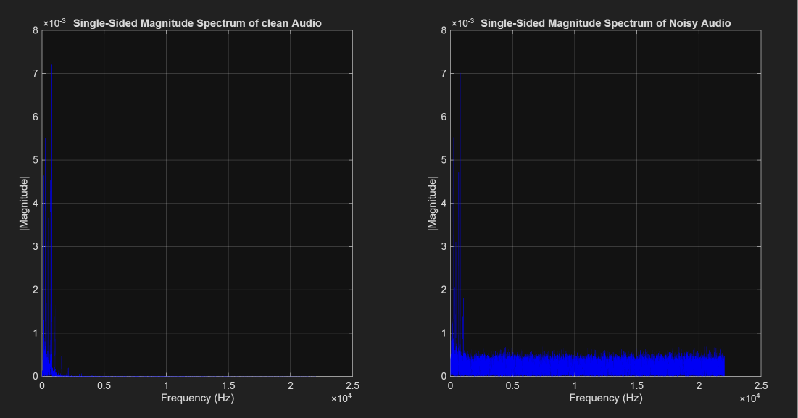

# Audio signal Denoising using Digital Filters

## Core DSP Concepts Applied:

* **Time-Frequency Transformation:** Utilized the Fast Fourier Transform (FFT) to convert time-domain audio arrays into single-sided magnitude spectrums, isolating human voice frequencies from high-frequency Additive White Gaussian Noise (AWGN).
* **Adaptive Filter Design (Occupied Bandwidth):** Calculated the signal's power spectrum and integrate cumulative energy. The system automatically sets the filter cutoff frequency ($f_c$) at the exact 95% spectral energy threshold, adapting to any input audio file.
* **FIR vs. IIR Filter Implementation:** 
  * Designed a 6th-order **IIR (Butterworth)** filter to achieve a maximally flat passband and sharp frequency roll-off.
  * Designed a 50th-order **FIR (Windowed)** filter to ensure linear phase response.
  * Applied zero-phase digital filtering (`filtfilt`) to both to eliminate phase distortion and group delay.
* **Quantitative Evaluation & Normalization:** Mathematically calculated the Signal-to-Noise Ratio (SNR) to quantify filter performance.

## System Workflow

1. **Injection:** Loads an audio file and intentionally corrupts it with high-frequency AWGN.
2. **Spectral Analysis:** Computes the FFT to visualize the noise floor vs. the acoustic signal.
3. **Dynamic Filtering:** Calculates the 95% energy threshold and applies custom IIR and FIR low-pass filters.
4. **Reconstruction:** Normalizes the filtered arrays and calculates the final SNR improvements.

## Tech Stack
* **Language:** MATLAB
* **Toolboxes:** Signal Processing Toolbox


## Spectral Analysis

By converting the signals from the time domain to the frequency domain using FFT, we can visually identify the high-frequency AWGN burying the original acoustic signal. This analysis allows the algorithm to dynamically calculate the optimal cutoff threshold.



## Performance Results

When tested on a sample audio file, the adaptive bandwidth algorithm dynamically identified the optimal cutoff frequency and successfully recovered the signal from a negative SNR state:

```text
Filter Design:
Dynamically calculated Cutoff Frequency: 792.40 Hz

SNR Results:
Original Noisy Signal SNR:  -5.36 dB
After IIR Filter SNR:6.86 dB (Improvement: +12.23 dB)
After FIR Filter SNR:5.86 dB (Improvement: +11.23 dB)

